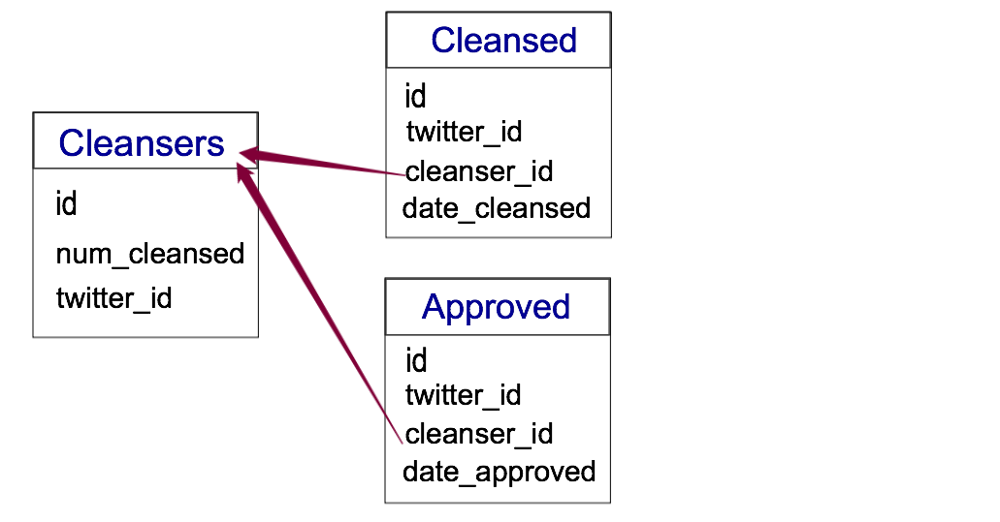

# Cleanse

# Short description of your app
Cleanse is an application built to cleanse your social media. It will remove harmful and offensive tweets and allow you to unfollow and remove any content that is potentially damaging for viewers. This app will allow your feed to look more professional and interview ready so that your feed will not put off any potential recruiters.  

# Wireframes
https://www.fluidui.com/editor/live/preview/p_6Mng826ONsacWTC5pxVVW1TneXpX2GEo.1457654594268

# User Stories
What we absolutely want to complete:
* [ ] Use the Twitter API to find followers or retweeter of user
  * [ ] show list of each followers' tweets and content
    * [ ] have an option to unfollow and block
  * [ ] Create blacklist of tweets
    
Optional Features: 
* [ ] Have an option to confirm whether or not a tweet or retweet should be deleted 
* [ ] Related Suggestions
* [ ] Extending to Facebook
* [ ] Review Blocks (for unblocking)

#Collection Structure/ Data Schema
* 3 Collections in Total: 
   * Cleansers
     * Columns:
       * twitter_id (Unique identifier provided by Twitter API)
       * num_cleansed
       * id of element in database collection
       * (Optional ?) Twitter handle
   * Cleansed: Twitter accounts that have been cleaned by a particular cleanser
     * Columns: 
       * twitter_id (of the person who has been cleansed from the cleanser's twitter timeline)
       * cleanser_id (twitter id of cleansed person) 
       * date_cleansed (timestamp of when person was cleansed <- ideally cleansed database will delete all cleansed people after a certain period of time [probably 30 days] to free space in collection) 
       * _id of element in collection
   * Approved: Twitter people who have been approved by a particular cleanser
     * Keys:
       * twitter_id (twitter id of person approved) 
       * cleanser_id (twitter id of person who approved this twitter account) 
       * date_approved (timestamp of date approved action took place <- Ideally after a period of time, elements will be trimmed down)
       * _id of the element in the collection 
 </img>
#API Endpoints
* <a href="https://dev.twitter.com/rest/reference/get/friends/list">GET friends/list (aka get people following current user list) </a>
* <a href="https://dev.twitter.com/rest/reference/post/blocks/create">POST blocks/create</a>
* <a href="https://dev.twitter.com/rest/reference/get/followers/list">GET followers/list</a>
* <a href="https://dev.twitter.com/rest/reference/get/statuses/user_timeline">GET statuses/user_timeline</a>
* Optional API endpoints that may be used:
  * <a href="https://dev.twitter.com/rest/reference/get/blocks/ids">GET blocks/ids (list of active blocks of user)</a>

#Model Classes
* ParseClient
  * class to deal with all database actions in the Parse Server and connecting to the server
* TwitterClient
  * class to deal with all Twitter API requests
* User class
  * class for Twitter User with all their corresponding timeline, id, handle, etc information

# Considerations
### Product Pitch
* Prepping for a job interview? Afraid your social media might show your bad side to your future employer. It's time to cleanse your social media with CLEANSE, an iOS app to make your cleansing experience as easy as possible. 

### Audience
* People looking for jobs, internships
* Students (particularly those applying to univeristy, grad school, medical school, etc)

### Core Functions
* User of app will log in and interact with card swiping of Twitter profiles
* Unfollow people deemed "not clean" by the user of the app

### Projected Final Demo
* User will log into app
* Swipe through list of friends to unfollow
* Swipe through list of followers to block
* User will logout

### Mobile Features Leveraged
* Twitter API, gesture recognizers 

### Technical Concerns
* Maintaining a stack so there is an option for undoing
* Having a great UX for the users